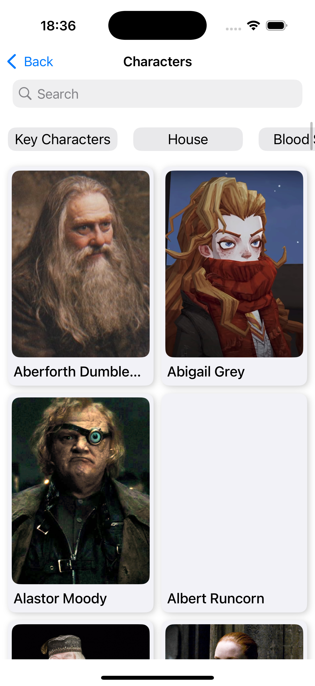
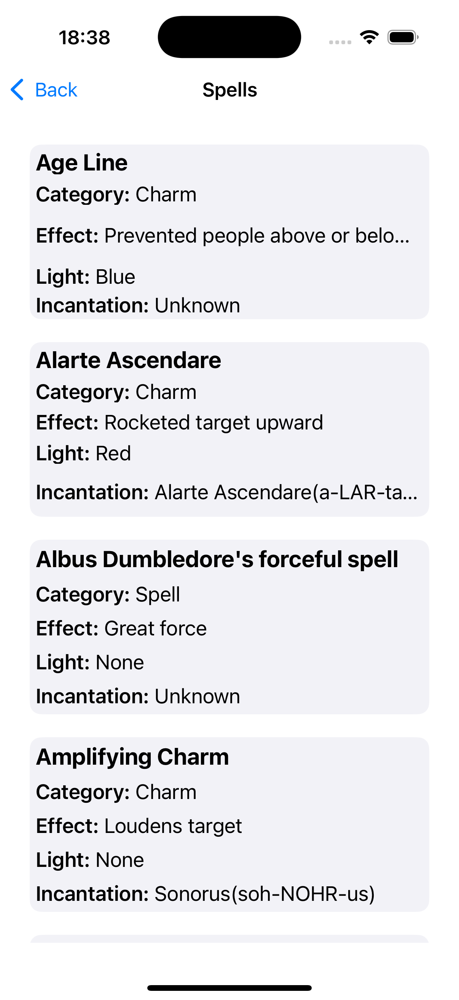
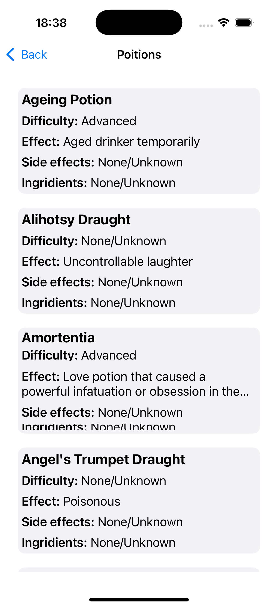
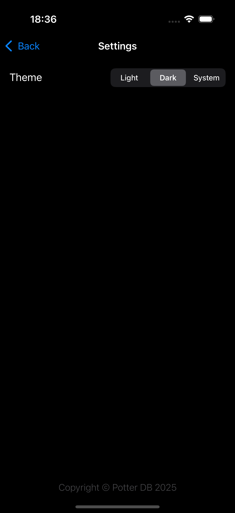
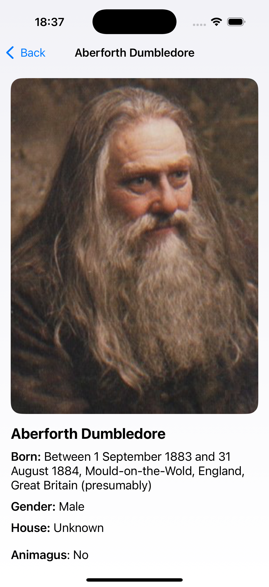
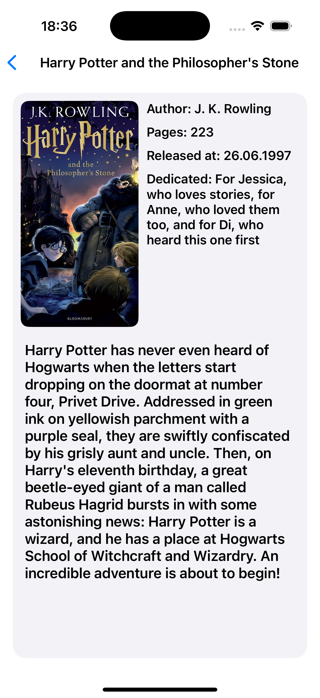
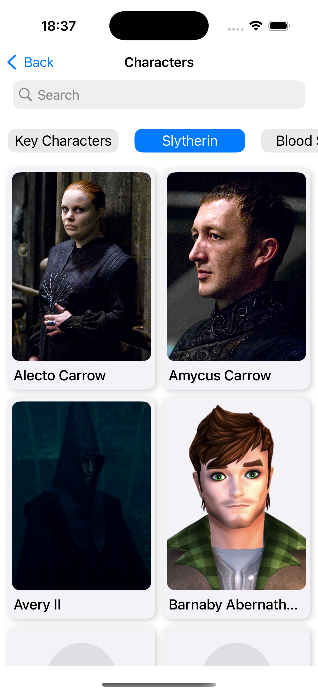
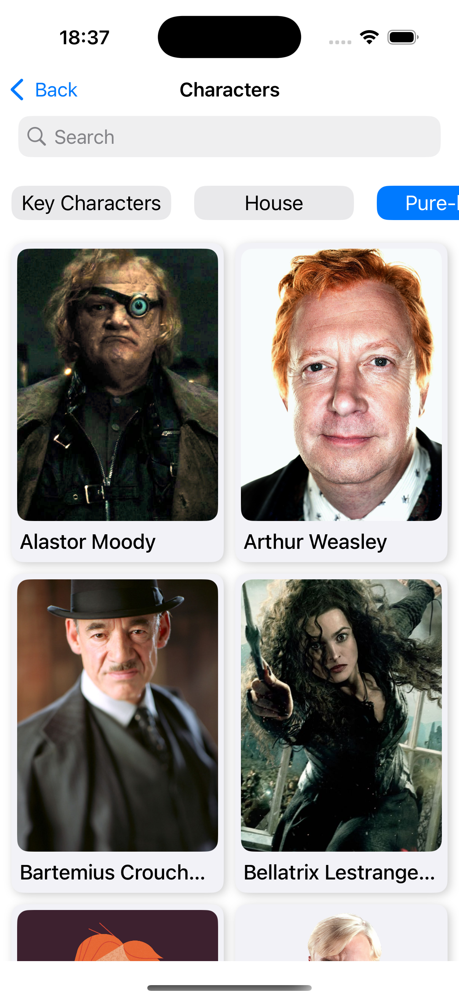
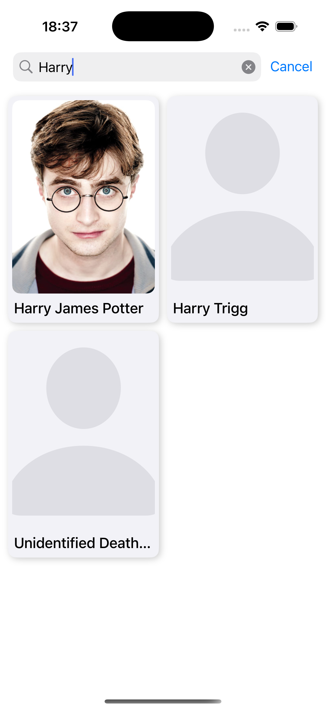

# Harry Potter Wiki

*"Вики приложение по вселенной Гарри Поттера"*

---

## 🎯 Возможности
  - Информация по персонажам, книгам, фильмам, зельям и заклинаниям из вселенной
    
## 🧰 Технологии
  - Swift 5
  - MVVM
  - Combine (Searching)
    
## Ссылки:
  - https://potterdb.com

## 📸 Скриншоты
<table>
  <thead>
    <tr>
      <th>Меню</th>
      <th>Персонажи</th>
      <th>Книги</th>
      <th>Фильмы</th>
      <th>Заклинания</th>
      <th>Зелья</th>
      <th>Настройки</th>
    </tr>
  </thead>
  <tbody>
    <tr>
      <td></td>
      <td></td>
      <td></td>
      <td></td>
      <td></td>
      <td></td>
      <td></td>
    </tr>
    <tr>
      <td><width="200"></td>
      <td></td>
      <td></td>
      <td></td>
      <td><width="200"></td>
      <td><width="200"></td>
      <td><width="200"></td>
    </tr>
    <tr>
      <td><width="200"></td>
      <td></td>
      <td><width="200"></td>
      <td></td>
      <td><width="200"></td>
      <td><width="200"></td>
      <td><width="200"></td>
    </tr>
    <tr>
      <td><width="200"></td>
      <td></td>
      <td><width="200"></td>
      <td><width="200"></td>
      <td><width="200"></td>
      <td><width="200"></td>
      <td><width="200"></td>
    </tr>    
    <tr>
      <td><width="200"></td>
      <td></td>
      <td><width="200"></td>
      <td><width="200"></td>
      <td><width="200"></td>
      <td><width="200"></td>
      <td><width="200"></td>
    </tr>
    <tr>
      <td><width="200"></td>
      <td></td>
      <td><width="200"></td>
      <td><width="200"></td>
      <td><width="200"></td>
      <td><width="200"></td>
      <td><width="200"></td>
    </tr>
    <tr>
      <td><width="200"></td>
      <td></td>
      <td><width="200"></td>
      <td><width="200"></td>
      <td><width="200"></td>
      <td><width="200"></td>
      <td><width="200"></td>
    </tr>
  </tbody>
</table>
